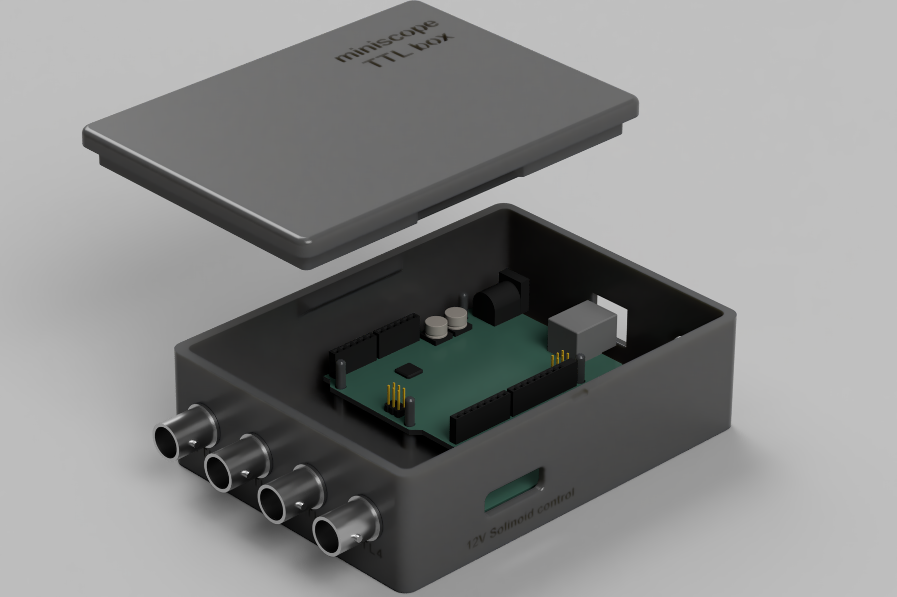
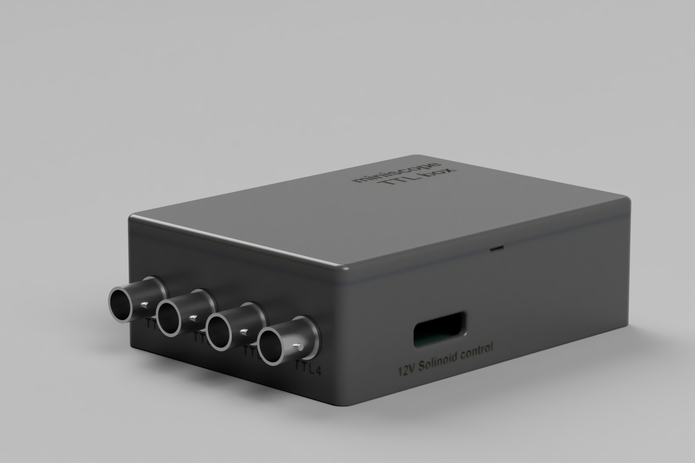
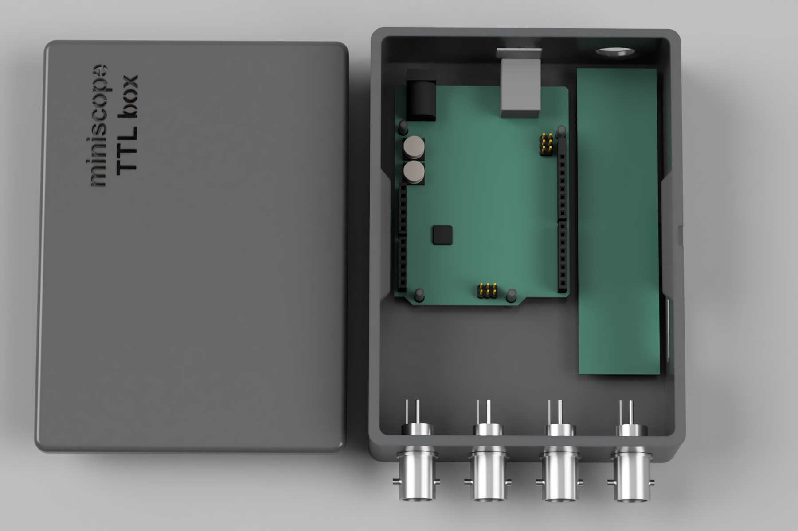
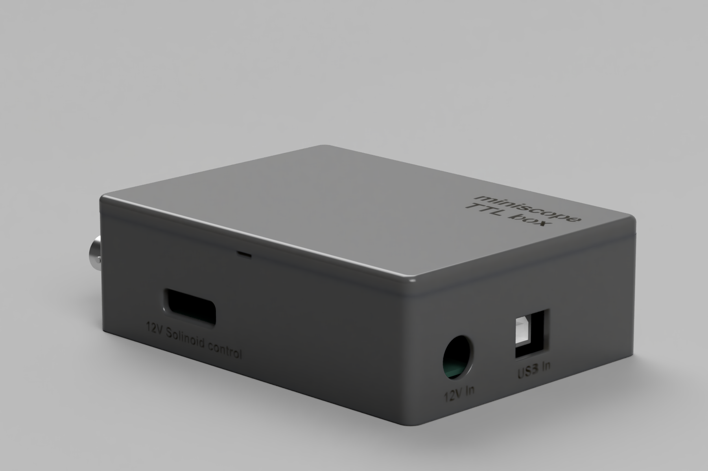
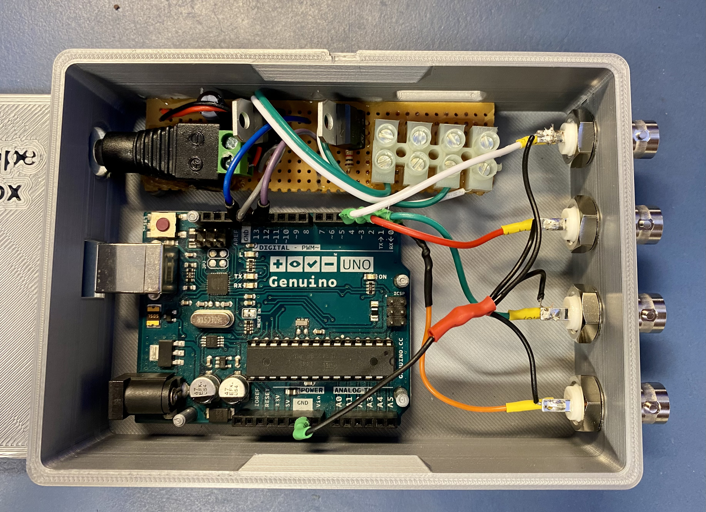

# 3D printable TTL box for arduino

3D printable TTL box to interface between python/matlab via arduino with BNC connection outputs to trigger experiment contingencies. Included are 3D models created using Fusion 360 and 3D printing .stl files. 

   

&nbsp;

## Use case: miniscope TTL and solinoid box 
An example use case outlined here is to interface between matlab/python and inscopix miniscope equipment to trigger both 12V solinoid valves and 5V TTL pulses.

 
&nbsp;

### How to
1. [Required components](#components-needed)
2. Solinoid circuitry
3. 3D printing and essembly

--- 

### Components needed

| Component             | Description                              | Source		              	|Reference            | Quantity  |
|-----------------------|------------------------------------------|----------------------------------|---------------------|-----------|
| Arduino uno		| Arduino microcontroler               	 | Online	                      	| 			    | 1         |
| Solinoid valves        | 12V solinoid valves			       | cole-parmer			      | 98302-02		   	    | 2	    | 
| BNC connectors	      | male BNC connectors to allow connection with BNC cables  | RS 			| 			546-4910    | 4         |
| TIP120 Transistor	      | Transistor for solinoid circuit  | RS 			| 			    | 2         |
| 1N4001-T Diode	      | Diode for solinoid circuit  | RS 			| 			    | 2         |
| 1KOhm Resistor	      | Resistor for solinoid circuit  | RS 			| 			    | 2         |
| Circuit stripboard   | strip board to essemble solinoid circuit | RS   |   | 1  |
| DC jack connector   | 5.5 X 2.1mm DC power Jack | RS   |   | 1  |
| Capacitor   | 100uF 50V for power surge protection | RS   |   | 1  |

